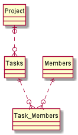
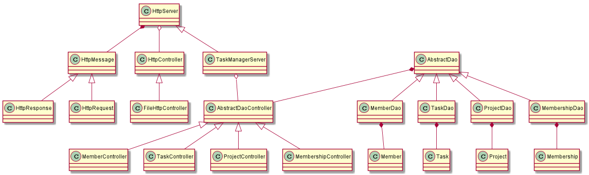

# PGR203 - Eksamen - TaskManager

## Hvordan kjøre dette programmet

### Bygg og test executable jar-fil

1. Legg til databaseinfo i en task-manager.properties fil
2. Bygg prosjektet ved å kjøre kommandoen: mvn package  
3. Start TaskManager ved å kjøre kommandoen: java -jar target/Task-Manager-1.0-SNAPSHOT.jar

### Funksjonalitet

* For å komme til TaskManagerens førsteside kan man i nettleseren navigere til:
    -  [localhost:8080](localhost:8080)
    -  [localhost:8080/](localhost:8080/)
    -  [localhost:8080/index.html](localhost:8080/index.html)
* Fra førstesiden kan man velge mellom :
    * PROJECTS 
    * TASKS 
    * MEMBERS
* I alle kategoriene er det mulig å legge til og liste henholdsvis prosjekt, oppgave eller medlem. 
* Under MEMBERS kan man sette et medlem ansvarlig for en oppgave og se oppgaver tildelt et medlem.
* Under MEMBERS kan man også endre navn og alder på medlemmet.
* Under TASKS kan man se medlemmer tildelt en oppgave og endre oppgavens navn eller status.

## Designbeskrivelse
#### Database

#### Klasser

TaskManagerServeren i seg selv er bare en implementasjon av HttpServeren, men lagt til controllerne for å håndtere JDBC mot databasen. 
Det er implementert en kontroller for hver av databaseobjektene, og alle er AbstractDaoControllere.
Den abstrakte kontrolleren består av metoder som håndterer de ulike tingene man kan gjøre mot databasen(liste objekter, lage nytt objekt, endre det) med riktig respons for HttpRequesten og kaller på metoder fra barneklassene for å få riktig format og data.
Disse kontrollerene er altså avhengige av at både databaseObjektet og databaseDaoObjektet.
Det er url-ene localhost:8080/api/objekt? som vil føre til at de riktige kontrollerene blir brukt, imens resten av request-pathen håndtere i kontrolleren.

HttpResponse og HttpRequest er begge HttpMessages, og er klasser for å håndtere innkommende request, generere nye requests/responser o.l.

Hvert databaseObjekt har i tillegg en Dao, der dao-en håndterer mot databasen og databaseObjektet representerer en rad i databasen.

## Egenevaluering

### Hva vi lærte underveis
Vi har lært masse! Begge to følte seg ganske usikre i begynnelsen av eksamensprosjektet, og det ble tydeligere og tydeligere for oss hvordan vi skulle implementere ting etterhvert. Kanskje litt fordi forståelsen vår for kodebasen ble større og større jo mer vi prøvde å implementere ting.
Det er litt vanskelig å si noe konkret man har lært, for alt har jo egentlig vært helt nytt. Men vi kan jo nevne at vi har jo i all hovedsak parprogrammert, noe vi tror har hjulpet oss på forståelsen i at man kan forklare hverandre ting underveis(og ikke minst se dumme skrivefeil som ødelegger koden!).
### Hva vi fikk til bra i koden vår
Vi er veldig fornøyde med at vi klarte å få til det vi syns er en ganske grei kontroller-håndtering. Fra starten av hadde vi fokus på at kontrollerene skulle gjøre det lett å implementere nye.
Selv om det er kanskje delen som har forandret seg mest i løpet av hele prosessen, mye fordi det var vanskelig å finne ut av hvordan vi skulle opprettholde lesbarheten til kontrollerene, og vi føler vi har klart det kanskje hovedsaklig ved at de er alle er veldig like.

Vi har 
### Hva vi skulle ønske vi hadde gjort annerledes
Selv om vi har fått til å skille ut HttpRequest til en barneklasse av HttpMessage er fortsatt den delen ganske rotete, og vi skulle ønske vi brukte bedre tid på å refactorere HttpMessage og dens barneklasser.
I tillegg er vi ganske sikre på at det er en del rot her og der vi ikke har helt oversikt over. Og kanskje sist men ikke minst så tenker vi at vi garantert hadde gjort godt av litt flere, og kanskje bedre tester.
Men det er kanskje det vi har funnet mest utfordrende med denne oppgaven. Spesielt i begynnelsen når vi egentlig ikke var så komfortable med koden fra de to forrige innleveringene så var det veldig vanskelig å starte med å skrive en test, litt fordi vi var usikre på om det var noen som helst måte å få det vi prøvde på til å fungere.

## Evaluering fra annen gruppe
   Se: issues

## Evaluering gitt til annen gruppe
* [Link til issues](https://github.com/Westerdals/pgr203-2019-eksamen-hansmaast/issues)
    
## Annet
*  [Link til pingpong-programmering video](https://vimeo.com/373804252)
